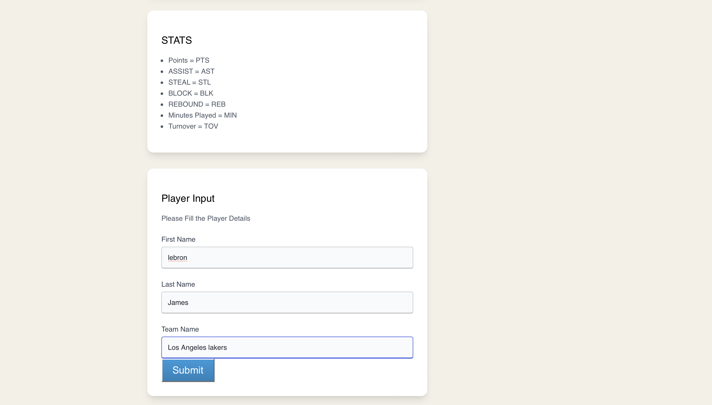
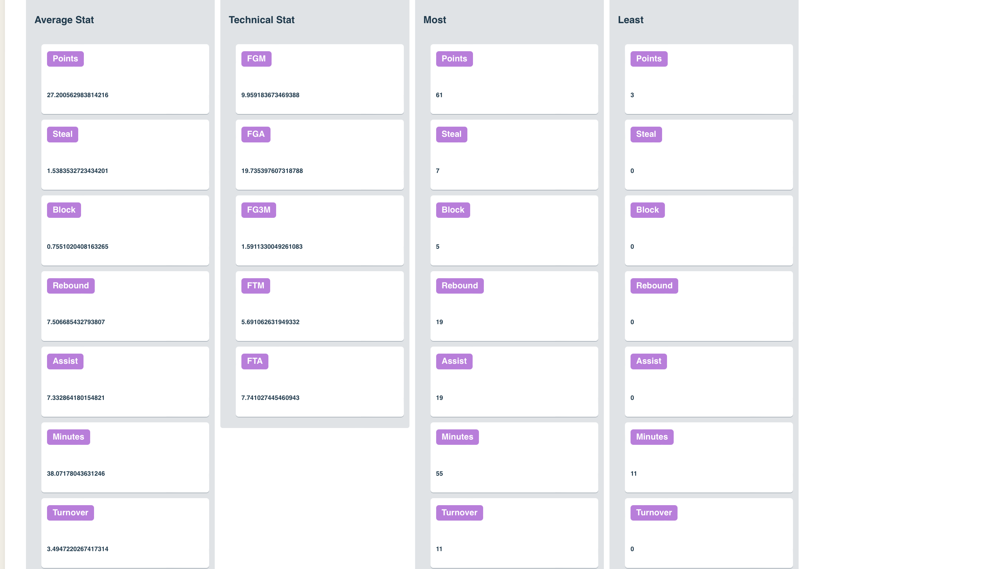

# NBA ML

## Data Science & Machine Learning on NBA currently active players. 

1. **V1** Contains the Statistics done using  pandas  and numpy. 

All Machine learning algorithms / functions can be found in the ML folder / directory. 

- Statistics , Multivariable & other metrics data in the Multivariable.py file. 
- Gradient Descent in the Descent.py file. 
- Regressive in the Regression.py file. 

Install dependencies with ```pip``` or  ```your version of pip```

Run file with ```python filename``` or ```your version of python```


2. **V2** Contains a ui to easily interact with the player data / statistics. 

Just Search by the player's real *"first name"* , *“last name”* and *“current team “* as written in the ui documents. **No Abbreviations**

Go to ( https://nba-ml-frontend-1a7155451cf7.herokuapp.com/ ). to see the ui in action. 

Run ```“app.py”``` in the Frontend folder/ directory to run the ui locally. 



Frontend ```/``` route is shown in the image above.



```"/"``` route to access player statistics.

```/correlation``` route to access player correlation metrics.

UI is served using ```flask``` & ```jinja``` for templating and ```Amazon S3``` for file storage. 

3. V3 UPCOMING. 

“vs team” route to access the player statistical and other metrics vs a particular team. 
